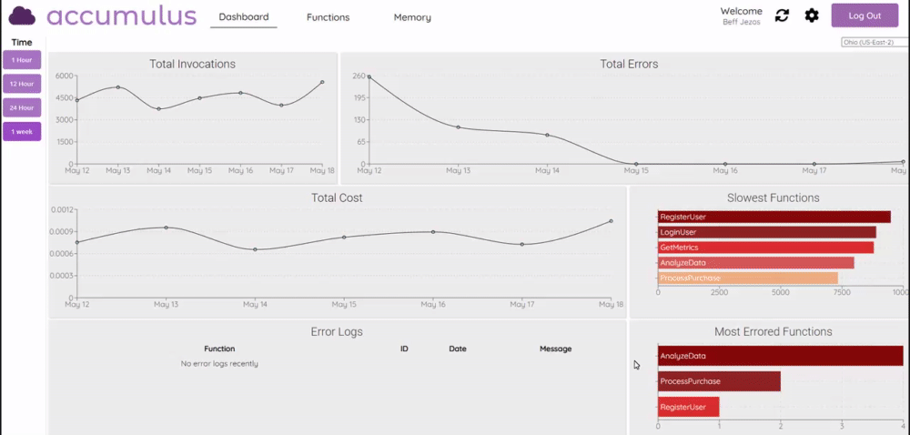
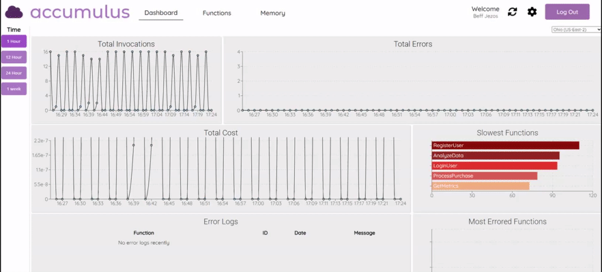
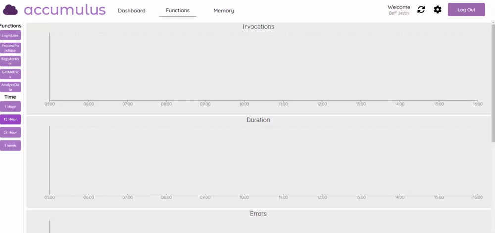
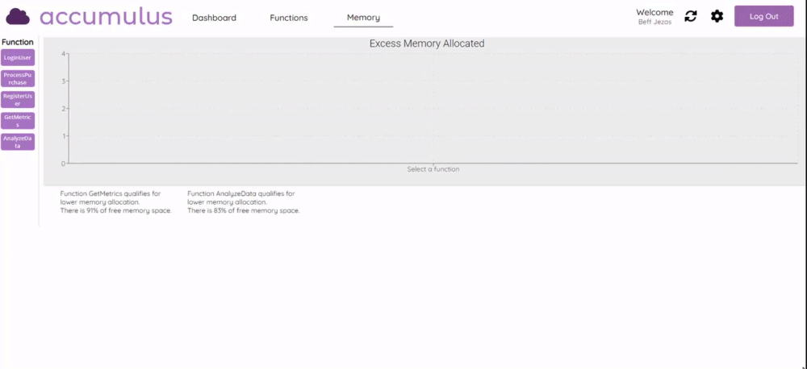

In Progress

<h2>About Accumulus</h2>

AWS Lambda functions are the central components of AWS serverless application architecture.
It is intimidating to navigate the extensive AWS docs and hundreds of services, and can be challenging to visualize the metrics for serverless applications.

Currently, monitoring tools for Lambda make it difficult to directly compare two Lambda functions side by side. Our solution is a web application that provides comprehensive charts for direct comparison of functions while presenting bottlenecks and resource allocation adjustments.

Project Links: [Github](https://github.com/oslabs-beta/Accumulus) | [Linkedin](https://www.linkedin.com/addThisSoon) | [Press](https://medium.com/addThisSoon)

<h2>🛠️ Getting Started:</h2>

Visit www.accumulus.dev

1. Existing user? You can log in using your email and password!

2. For new users, click "Register" to create a new user account.

3. Follow the link and instructions on the Registration page to assign a Cloud Formation Stack.

4. Copy and paste the unique AWS ARN outputted from the prior step.

5. Log in with the registered credentials.

6. Done!

<h2>Monitoring Features:</h2>

1. At the Dashboard, users can select different time increments for a broad overview of their Lambda funtions, as well as select from different AWS regions.

2. Users can also refresh the page with the sync button to grab the most recent data.

3. To get a more in-depth view of one or many functions, navigate to the Functions page. Once on the Functions Page, users can select the functions that they would like to view, as well as changing the time increments displayed on the graphs.

4. On the Memory Page, users can select the functions that they would like to view, and are presented with information for memory allocation adjustments

<h2>Authors:</h2>

Matt Femia - [Github](https://github.com/mattfemia) || [Linkedin](https://www.linkedin.com/in/mattfemia/)

Christian Sansovich - [Github](https://github.com/christiansansovich) || [Linkedin](https://www.linkedin.com/in/christian-sansovich/)

Dan Teng - [Github](https://github.com/danwteng) || [Linkedin](https://www.linkedin.com/in/danwteng/)

Eric Wu - [Github](https://github.com/EZW1) || [Linkedin](https://www.linkedin.com/in/ericzfwu/)

Mark Yencheske - [Github](https://github.com/markyencheske) || [Linkedin](https://www.linkedin.com/in/mark-yencheske-62698122b/)

<h2>Contributing:</h2>

 Have a suggestion? Found a bug? Want to make Accumulus better?

Please submit issues/pull requests if you have feedback or message the Accumuls team to be added as a contributor: accmulusdev@gmail.com

<h2>💻 Built with:</h2>

- [Typescript](https://www.typescriptlang.org/)
- [React](https://reactjs.org/)
- [ReactRouter](https://reactrouter.com/)
- [NodeJS](https://nodejs.org/en/)
- [Express](https://expressjs.com/)
- [MongoDB](https://www.mongodb.com/)
- [Mongoose](https://mongoosejs.com/)
- [Styled Components](https://styled-components.com)
- [ReCharts](https://recharts.org/)
- [Redis](https://redis.io)

<h2>License</h2>

This project is licensed under the MIT License - see the LICENSE.md file for details
